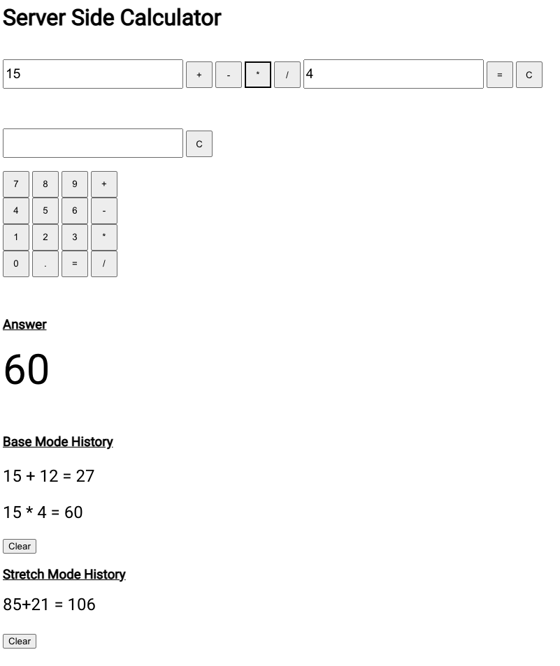

# Weekend Server Calculator

# Description

Time to complete: A few days

This project takes in two input values and a mathematical operation type. Clicking the equals button sends those values to the server to calculate an answer without using eval() and finally sends the answer back to be displayed on the DOM. Clicking the C button clears the values in the input field and resets the operation type. The calculations done are saved in a history below the calculator. Clicking the clear button in the history div will erase the previous calculations. The 2nd calculator (with more buttons and only one input field) was my attempt at some stretch goals that were assigned.

# Prerequisites

Node.js

# Screenshot

# Installation

1. Run npm install in your terminal
2. Run npm start in your terminal
3. Navigate to localhost:5001 in your browser

